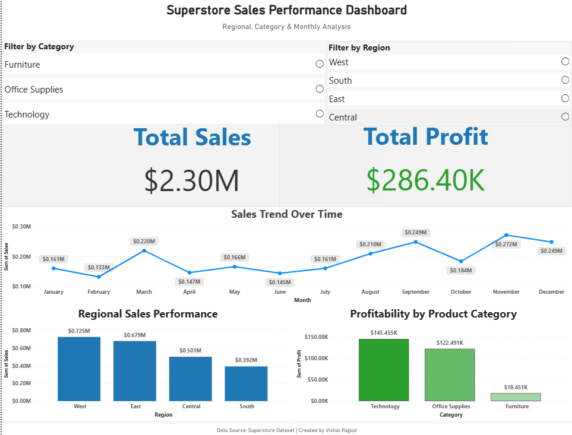

# Sales Analysis Dashboard

## 📌 Project Overview

This project analyzes sales performance using the Superstore dataset.
The dashboard provides insights into sales trends, profit analysis, and regional performance to support business decision-making.

## 📊 Dataset

- Source: Superstore Dataset (Kaggle)
- Contains sales transactions, profit, region, category, customer, and order details.

## 🛠 Tools Used

- Power BI (Dashboard Development)
- Python (Pandas, Matplotlib for analysis)
- Excel (Data preprocessing)
- GitHub (Version control)

## 🔄 Analysis Process

1. Data cleaning and preprocessing
2. Exploratory data analysis
3. Sales trend analysis
4. Regional and category performance analysis
5. Dashboard creation in Power BI
6. Business insights generation

## 📈 Key Insights

- West region generated the highest sales.
- Technology category produced the highest profit.
- Monthly sales show seasonal patterns with peak performance in September.

## 📊 Dashboard Features

- Total Sales
- Total Profit
- Sales Trend Over Time
- Regional Sales Performance
- Profitability by Product Category
- Filter by Category
- Filter by Region

## ▶ How to Run

1. Download dataset from `/data` folder
2. Open `sales_dashboard.pbix` in Power BI
3. Interact with filters to explore insights

## 📷 Dashboard Preview

